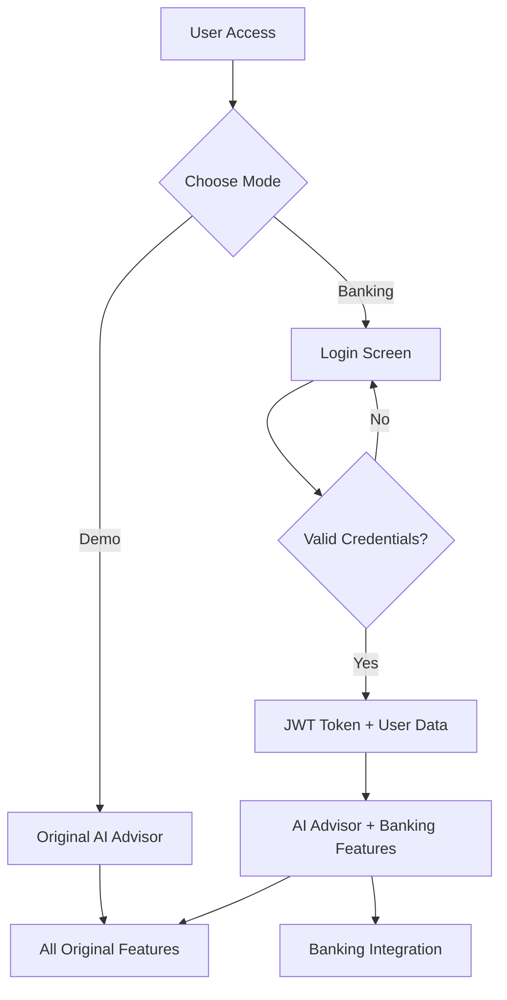

# Design Document

## Overview

O design mantém toda a arquitetura e funcionalidades existentes do AI Economic Advisor, adicionando uma camada opcional de autenticação bancária. O sistema funcionará em dois modos: **Demo Mode** (original) e **Banking Mode** (autenticado), preservando a experiência rica existente.

## Architecture

### Dual Mode Architecture
```
┌─────────────────────────────────────────────────────────────┐
│                    AI Economic Advisor                      │
├─────────────────────────────────────────────────────────────┤
│  Demo Mode (Original)           │  Banking Mode (New)       │
│  ├─ All original features       │  ├─ All original features │
│  ├─ Google API integration      │  ├─ Google API integration│
│  ├─ Gemini AI chat             │  ├─ Gemini AI chat        │
│  ├─ Beautiful UI/Charts        │  ├─ Beautiful UI/Charts   │
│  └─ Demo investments           │  ├─ Real banking saldo    │
│                                │  ├─ JWT authentication    │
│                                │  └─ Transaction history   │
└─────────────────────────────────────────────────────────────┘
```

### Authentication Flow


## Components and Interfaces

### 1. Authentication Layer (New)
- **BankingAuth Component**: Handles login/logout
- **JWT Token Management**: Secure session handling
- **User Context Provider**: Maintains authentication state

### 2. Mode Switcher (New)
- **Entry Point Router**: Determines demo vs banking mode
- **Feature Flag System**: Enables/disables banking features
- **State Persistence**: Maintains user session

### 3. Banking Integration (Enhanced)
- **Balance Display**: Shows real bank balance in UI
- **Transaction Validator**: Checks sufficient funds
- **Investment Executor**: Processes real transactions
- **History Tracker**: Records all banking operations

### 4. Original Features (Preserved)
- **All existing components remain unchanged**
- **Google API integration maintained**
- **Gemini AI chat preserved**
- **Beautiful UI/UX kept intact**
- **Market analysis functionality retained**

## Data Models

### User Authentication
```javascript
{
  user: {
    id: string,
    username: string,
    full_name: string,
    account_number: string,
    balance: number
  },
  token: string,
  isAuthenticated: boolean,
  mode: 'demo' | 'banking'
}
```

### Banking Transaction
```javascript
{
  id: string,
  account_number: string,
  type: 'buy' | 'sell',
  symbol: string,
  quantity: number,
  price: number,
  total: number,
  timestamp: Date,
  ai_recommendation: boolean
}
```

### Application State
```javascript
{
  mode: 'demo' | 'banking',
  user: User | null,
  bankingFeatures: {
    enabled: boolean,
    balance: number,
    transactions: Transaction[]
  },
  originalFeatures: {
    // All existing state preserved
    portfolio: Portfolio,
    marketData: MarketData,
    aiInsights: AIInsights
  }
}
```

## Error Handling

### Authentication Errors
- **Invalid Credentials**: Show error message, allow retry
- **Token Expiry**: Auto-refresh or redirect to login
- **Service Unavailable**: Fallback to demo mode with notification

### Banking Operation Errors
- **Insufficient Funds**: Block transaction, show balance
- **Service Error**: Log error, maintain UI state
- **Network Issues**: Queue operations, retry mechanism

### Graceful Degradation
- **Banking services down**: Continue in demo mode
- **API failures**: Show cached data with warning
- **Authentication issues**: Preserve original functionality

## Testing Strategy

### Unit Tests
- Authentication flow components
- Banking integration functions
- Mode switching logic
- Transaction validation

### Integration Tests
- End-to-end login flow
- Banking service integration
- Original features preservation
- Mode transitions

### User Experience Tests
- UI consistency between modes
- Feature parity validation
- Performance impact assessment
- Error handling scenarios

## Implementation Approach

### Phase 1: Authentication Layer
- Add optional login entry point
- Implement JWT token management
- Create user context system
- Preserve all existing functionality

### Phase 2: Banking Integration
- Integrate balance display
- Add transaction validation
- Implement real investment execution
- Create banking history view

### Phase 3: UI Enhancement
- Add banking mode indicators
- Integrate balance in existing UI
- Enhance investment buttons with real actions
- Maintain original beautiful design

### Phase 4: Testing & Polish
- Comprehensive testing
- Performance optimization
- Error handling refinement
- Documentation updates